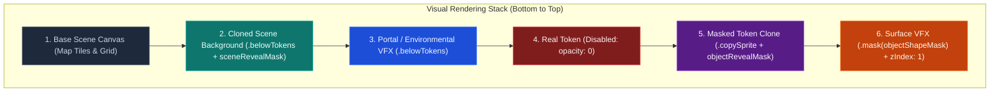
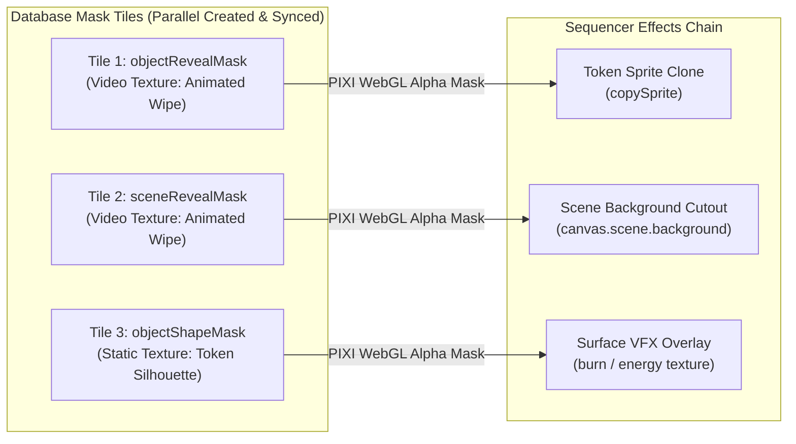
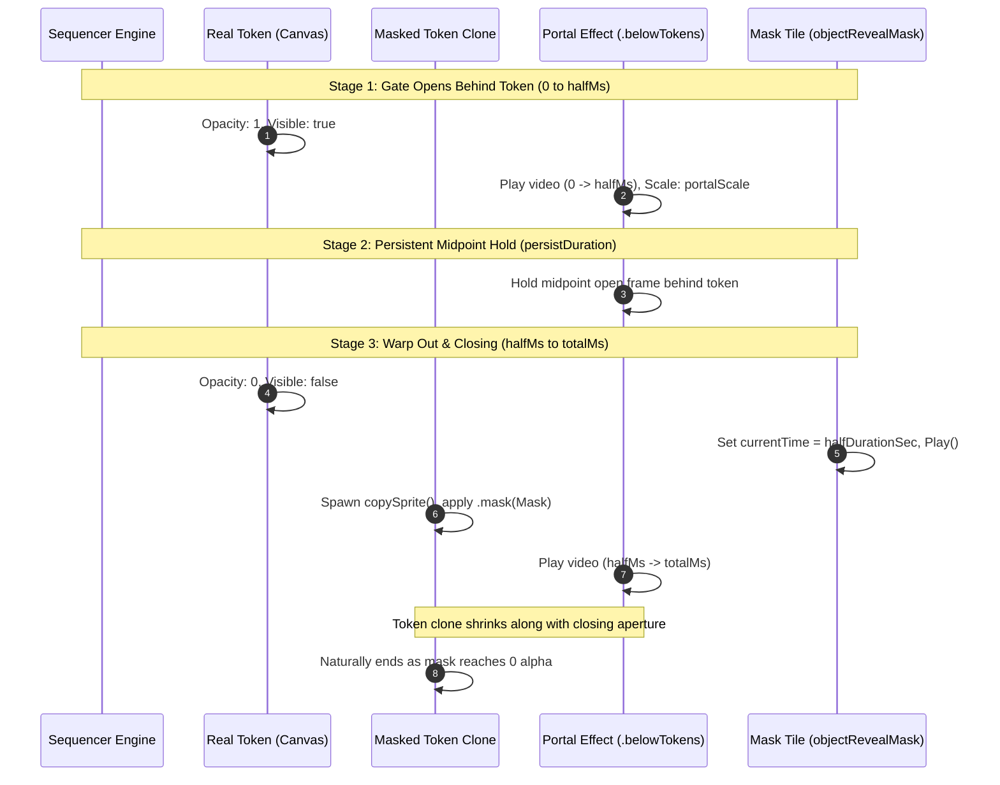
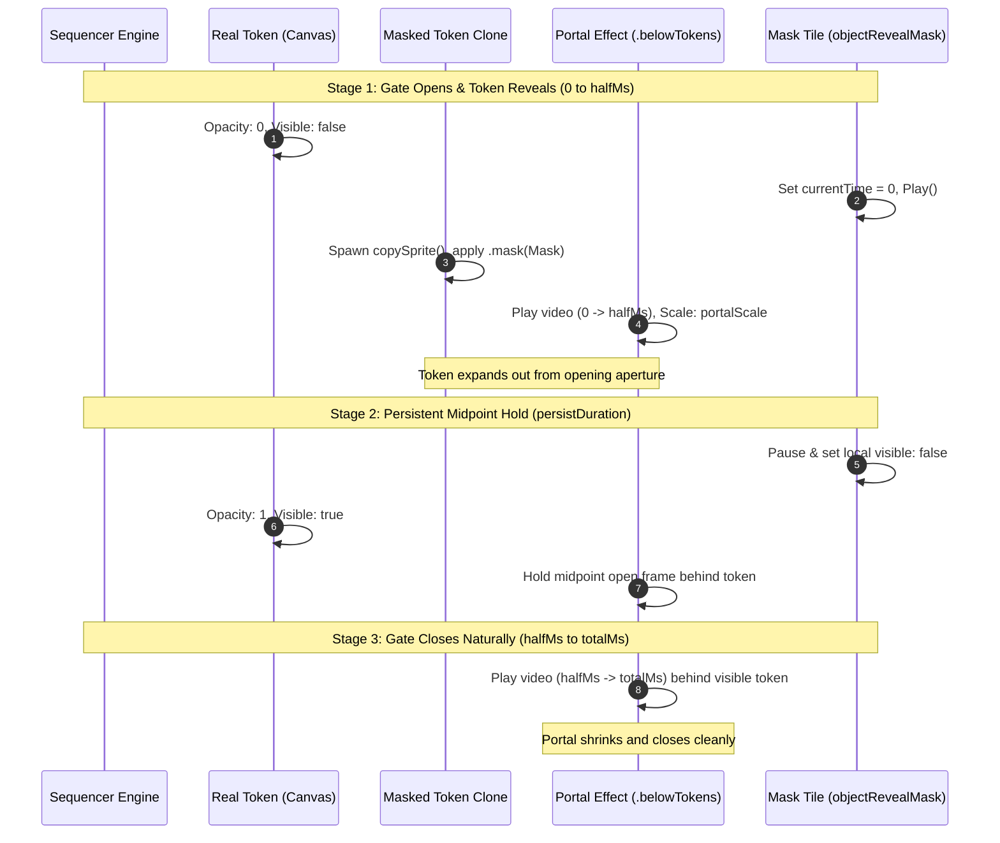
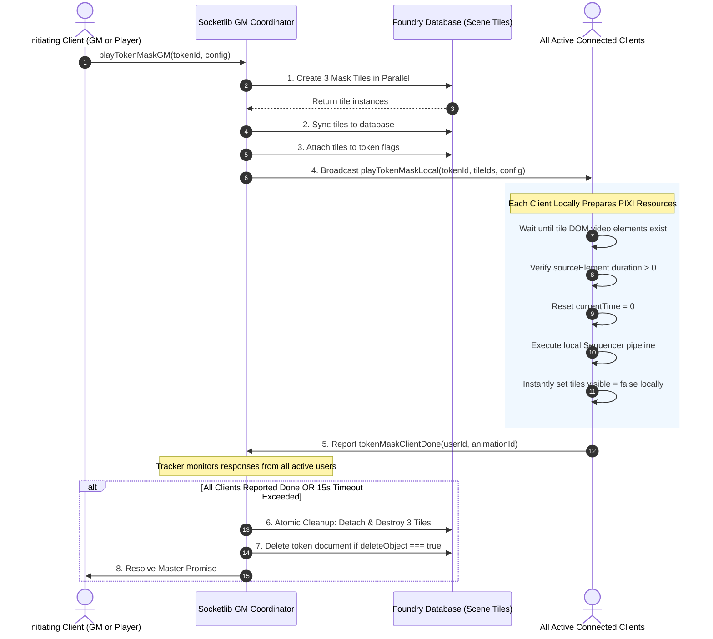

# Token Mask Animation Architecture & Vanishing VFX Guide

This document provides a comprehensive technical breakdown of how **Token Mask Effects** (such as Warp In/Out, SAO Death Shatter, Burn, Smoke, and Tear) are constructed in the `eskie-macro-pack`. It details the **Three-Tile Alpha Masking Pipeline**, the **Rendering Layer Hierarchy**, the **PixiJS WebGL Masking Mechanics**, and the **Multi-Client Synchronization Lifecycle**, along with ready-to-use code snippets.

---

## 1. Overview & Problem Statement

### The Problem
When animating a token disappearing (teleporting, disintegrating, or warping out) in Foundry VTT, naive approaches rely on uniform opacity fading (`opacity(0)`) or sudden visibility toggling (`show(false)`). This produces an unconvincing "ghost fade" or abrupt pop.

To create cinematic effects—where a token progressively dissolves into cinders, shatters into crystal shards, or shrinks away into an opening cosmic vortex—we need **per-pixel animated alpha wiping**. However:
1. Foundry VTT does not allow dynamic WebGL masking directly on active `Token` or `TokenDocument` objects without breaking core engine systems (vision polygon recalculation, lighting occlusions, HUD containers, and elevation sorting).
2. Mask video animations and visual overlays must be pixel-aligned to tokens of arbitrary scales, aspect ratios, rotations, and grid configurations.
3. Every active client connected to the game session must see the exact same synchronized animation frame simultaneously without visual jitter, race conditions, or lingering canvas artifacts.

### The Solution: The 3-Tile Masking Pipeline
The `eskie-macro-pack` solves this with a multi-layered composite strategy:
1. **Dynamic Database Mask Tiles**: Three temporary, invisible canvas tiles are generated and attached to the target token.
2. **Token Sprite Cloning**: The real token is smoothly hidden (`opacity: 0`), while a high-fidelity sprite clone is spawned on the Sequencer visual layer.
3. **WebGL `SpriteMaskFilter` Routing**: The clone's visual pixels and environmental background cuts are alpha-masked against the synchronized video textures of the hidden tiles.
4. **Coordinated Socketlib Orchestration**: The host GM coordinates asset preload, database synchronization, local PixiJS rendering verification, timed playback, and atomic teardown across all active clients.

---

## 2. Rendering Hierarchy & Layer Stacking

To achieve a seamless vanishing illusion, visual elements must be stacked in an exact, deterministic order from back to front.

### Visual Stacking Order (Back to Front)

```
==================================================================================
 [TOP]      Layer 6: Token-Constrained Overlay VFX (flames, crystal grid, runes)
            ├── Masked strictly by: objectShapeMask (Token Silhouette)
            └── Render Level: Sequencer Top Overlay (zIndex: 1)
----------------------------------------------------------------------------------
            Layer 5: Masked Token Sprite Clone (Token graphic wiping away)
            ├── Masked strictly by: objectRevealMask (Animated Video Alpha)
            └── Render Level: Sequencer Token Plane (Over Canvas / Behind HUD)
----------------------------------------------------------------------------------
            Layer 4: Real Canvas Token (Original PlaceableObject)
            └── State: opacity: 0 / show(false) during transition
----------------------------------------------------------------------------------
            Layer 3: Environmental / Portal VFX (Cosmic hole, vortex backdrop)
            ├── Render Level: Sequencer .belowTokens()
            └── Positioned: Directly centered behind the token
----------------------------------------------------------------------------------
            Layer 2: Masked Scene Background Cutout (Canvas Scene Background)
            ├── Masked strictly by: sceneRevealMask (Matching Video Alpha)
            └── Render Level: Sequencer .belowTokens() (Matches Map Plane)
----------------------------------------------------------------------------------
 [BOTTOM]   Layer 1: Canvas Scene Background (Base Map Layer)
==================================================================================
 [HIDDEN]   Database Mask Tiles (objectRevealMask, sceneRevealMask, objectShapeMask)
            └── State: alpha: 0, hidden: true (PIXI sourceElement used for WebGL)
==================================================================================
```

### Why Each Layer Is Seen Above Others



1. **Base Scene Background (Layer 1)**: The standard Foundry VTT canvas map tile.
2. **Masked Scene Background Cutout (Layer 2)**:
   - Uses `Sequencer.effect().file(canvas.scene.background.src).mask(sceneRevealMask).belowTokens()`.
   - *Why it is needed*: When a portal tears open or a token vanishes, the area behind the token must match the scene background cleanly. If there are background token drop-shadows or under-token lighting artifacts, this cutout ensures an unobstructed view directly through the portal aperture.
3. **Portal / Environmental Background VFX (Layer 3)**:
   - Uses `Sequencer.effect().file(tokenOverlayPath).belowTokens()`.
   - Because it is flagged `.belowTokens()`, it renders behind the token plane. The swirling cosmic portal or magic vortex appears situated directly behind the creature's back.
4. **Real Canvas Token (Layer 4)**:
   - At the beginning of the vanishing phase, `Sequence.animation().on(object).opacity(0).show(false)` hides the static token without destroying it in the database.
5. **Masked Token Sprite Clone (Layer 5)**:
   - Created via `Sequence.effect().copySprite(object).mask(objectRevealMask)`.
   - This clone adopts the token's exact texture, width, height, scale, and tint.
   - Because it sits on the normal Sequencer token layer (above `.belowTokens()`), it renders directly in front of the vortex.
   - As the `objectRevealMask` video plays, PixiJS clips the clone's pixels in real time, making the token appear to dissolve into the portal behind it.
6. **Token-Constrained Overlay VFX (Layer 6)**:
   - Used for burning flames, crackling lightning, or frost crystallization (`burn-mask.js`, `shatter-mask.js`).
   - Uses `.mask(objectShapeMask).zIndex(1)`.
   - By masking against `objectShapeMask` (which has the token's static silhouette texture), VFX textures are strictly bound to the creature's outline and never bleed into empty grid squares.

---

### Layer Stacking Snippet

```javascript
let seq = new Sequence();

// 1. Hide the original token
seq.animation()
    .on(token)
    .opacity(0)
    .show(false);

// 2. Layer 3: Portal background (behind token)
seq.effect()
    .file("eskie.environment.portal.warp.01.center.one_shot.full.purple")
    .attachTo(token, { bindAlpha: false, bindVisibility: false })
    .scaleToObject(5)
    .belowTokens()
    .locally(true);

// 3. Layer 5: Masked token clone (renders in front of portal, dissolved by mask)
seq.effect()
    .copySprite(token)
    .attachTo(token, { bindAlpha: false, bindVisibility: false })
    .scaleToObject(1, { considerTokenScale: true })
    .mask(objectRevealMask) // WebGL alpha video mask tile
    .locally(true);

// 4. Layer 6: Surface overlay VFX (contained within token silhouette)
seq.effect()
    .file("eskie.burn.token_mask.orange.no_base.fast.01")
    .attachTo(token, { bindAlpha: false, bindVisibility: false })
    .mask(objectShapeMask)  // Token silhouette stencil tile
    .zIndex(1)
    .locally(true);
```

---

## 3. How the Masking Works: WebGL & PixiJS Mechanics

### The 3 Mask Tiles

The core engine spawns three distinct tile documents in the Foundry database:



1. **`objectRevealMask`**:
   - **Texture**: An animated monochrome/alpha video (e.g., `eskie.texture_mask.tile_base.portal.warp.01.center.one_shot`).
   - **Role**: Feeds into PixiJS `SpriteMaskFilter` for the token sprite clone.
   - **Math**: Where the video is white/opaque ($A=1.0$), the token is rendered; where the video transitions to black/transparent ($A=0.0$), the token is discarded by the fragment shader.
2. **`sceneRevealMask`**:
   - **Texture**: A duplicate of the animated reveal video.
   - **Role**: Masks the cloned scene background layer to match the portal geometry.
3. **`objectShapeMask`**:
   - **Texture**: Set to `object.document.texture` (the token's own sprite image).
   - **Role**: Acts as a stencil mask for surface effects, conforming fire/ice/energy overlays to the precise contours of the character.

---

### Tile Creation Snippet

```javascript
async function createMaskTiles(object, config = {}) {
    const widthAdjustment = (object.document.documentName === 'Token') ? canvas.grid.size : 1;
    const maskScale = config.scale ?? 5;
    const scaleXY = object.document.texture.scaleX;

    const revealOffset = getRevealOffset(object, maskScale);
    const shapeOffset = getShapeOffset(object);

    // 1. Reveal mask tile definition (Animated WebM Video)
    const revealMaskData = {
        "texture.src": config.revealOverlayPath,
        "alpha": 0,
        "hidden": true,
        "x": revealOffset.x,
        "y": revealOffset.y,
        "width": (widthAdjustment * object.document.width) * scaleXY * maskScale,
        "height": (widthAdjustment * object.document.height) * scaleXY * maskScale,
        "rotation": config.rotation ?? 0,
        "video": { autoplay: false, loop: false, volume: 0 }
    };

    // 2. Shape stencil tile definition (Token Silhouette)
    const shapeMaskData = {
        "texture": object.document.texture,
        "alpha": 1,
        "hidden": true,
        "x": shapeOffset.x,
        "y": shapeOffset.y,
        "width": widthAdjustment * object.document.width,
        "height": widthAdjustment * object.document.height,
        "rotation": object.document.rotation
    };

    // 3. Create all three tiles in parallel in the Foundry database
    const [[objectRevealMask], [sceneRevealMask], [objectShapeMask]] = await Promise.all([
        socket.tile.create(revealMaskData),
        socket.tile.create(foundry.utils.deepClone(revealMaskData)),
        socket.tile.create(shapeMaskData)
    ]);

    // 4. Wait for database replication to all connected clients
    await Promise.all([
        socket.tile.sync(objectRevealMask.id),
        socket.tile.sync(sceneRevealMask.id),
        socket.tile.sync(objectShapeMask.id)
    ]);

    return [objectRevealMask, sceneRevealMask, objectShapeMask];
}
```

---

### PixiJS WebGL `SpriteMaskFilter` Execution

Under the hood, when Sequencer attaches a mask tile (`.mask(tile)`), PixiJS constructs a `SpriteMaskFilter`:

$$\text{Output Color} = C_{\text{target}} \times A_{\text{target}}$$
$$\text{Output Alpha} = A_{\text{target}} \times A_{\text{mask}}(u, v)$$

```
Target Pixel (Token Clone)      Mask Pixel (Video Mask)        Final Rendered Pixel
┌────────────────────────┐     ┌────────────────────────┐     ┌────────────────────────┐
│                        │     │        ░░░░░░░░        │     │                        │
│      [Token Body]      │  ×  │    ████████████████    │  =  │      [Half Dissolved   │
│       Alpha: 1.0       │     │     (Alpha: 1.0->0)    │     │          Token]        │
│                        │     │        ░░░░░░░░        │     │                        │
└────────────────────────┘     └────────────────────────┘     └────────────────────────┘
```

Because WebGL shaders evaluate this per frame at 60 FPS, the boundary of the token dissolves smoothly along the organic contours of the video mask.

---

### Anchor Point & Offset Normalization Across Foundry Versions

Foundry VTT changed tile anchor points in version 14:
- **Foundry V12 / V13**: Tile origin anchor was $(0, 0)$ (top-left). Token anchors were $(0.5, 0.5)$ (center) or grid-aligned.
- **Foundry V14+**: Tile origin anchors are $(0.5, 0.5)$ (center), matching tokens.

To prevent mask tiles from spawning offset from the token, coordinate calculations are normalized:

```javascript
function getRevealOffset(object, scale = 1) {
    const isV14Plus = foundry.utils.isNewerVersion(game.version, "14");
    const widthAdjustment = (object.document.documentName === 'Token') ? canvas.grid.size : 1;
    const scaleXY = object.document.texture.scaleX;
    const totalScale = scaleXY * scale;
    
    // Legacy (V12/V13): Calculate top-left compensation
    const legacyOffset = {
        x: object.x - (widthAdjustment * object.document.width * (totalScale - 1) / 2),
        y: object.y - (widthAdjustment * object.document.height * (totalScale - 1) / 2)
    };
    
    // V14+: Anchor is centered directly on object.center
    return isV14Plus ? object.center : legacyOffset;
}

function getShapeOffset(object) {
    const isV14Plus = foundry.utils.isNewerVersion(game.version, "14");
    return isV14Plus ? object.center : { x: object.x, y: object.y };
}
```

---

## 4. Multi-Stage Animation Pipelines (Warp In & Warp Out)

Standard one-shot video files lack embedded Sequencer loop markers. To prevent abrupt cutting or looping glitches, animations are structured into **3 distinct, deterministic stages**:

### Warp Out Sequence (Disappearing)

```
0ms                              halfMs                        halfMs + persistDuration            totalMs
│──────────────────────────────────│──────────────────────────────────────│───────────────────────────│
│ Stage 1: Opening Gate            │ Stage 2: Persistent Gate             │ Stage 3: Closing Outro    │
│ • Portal plays 0 -> halfMs       │ • Portal holds midpoint open frame   │ • Real token hidden (0)   │
│ • Real token visible (1.0)       │ • Real token visible (1.0)           │ • Mask video plays        │
│ • Portal sits behind token       │ • Portal holds behind token          │   halfMs -> totalMs       │
│                                  │                                      │ • Token clone shrinks     │
│                                  │                                      │   and closes into gate    │
```



---

### Warp In Sequence (Appearing)

```
0ms                              halfMs                        halfMs + persistDuration            totalMs
│──────────────────────────────────│──────────────────────────────────────│───────────────────────────│
│ Stage 1: Opening Gate            │ Stage 2: Persistent Gate             │ Stage 3: Closing Outro    │
│ • Real token hidden (0.0)        │ • Mask video paused & hidden         │ • Real token visible (1.0)│
│ • Mask video plays 0 -> halfMs   │ • Real token revealed (1.0)          │ • Portal plays            │
│ • Token clone reveals through    │ • Portal holds midpoint open frame   │   halfMs -> totalMs       │
│   opening mask aperture          │   behind token                       │ • Portal closes cleanly   │
```



---

## 5. Multi-Client Socketlib Lifecycle & Synchronization

Because Sequencer runs on each user's local browser, database creation, WebGL resource allocation, playback, and teardown must be strictly coordinated across all connected clients.



### Safety & Resilience Guardrails
1. **Local Instant Hide vs. Async Deletion**: When a sequence completes, tiles are set to `visible = false` immediately on the local PixiJS display tree. This guarantees no visual flicker while database deletion requests traverse the WebSocket network.
2. **Dynamic Effect Resolution**: Cleanup queries `Sequencer.EffectManager.getEffects({ name: label })` in a dynamic polling loop (`time.waitUntil`) ensuring WebGL sprite textures are unmounted before database documents are deleted.
3. **15-Second Watchdog Timeout**: If a player's client drops connection or lags during playback, the GM-side tracker triggers an automatic failsafe cleanup after 15 seconds, preventing orphaned mask tiles from remaining in the scene.

---

## 6. How to Build New Mask Effects

### Step-by-Step Recipe

1. **Identify Assets**:
   - **Reveal Mask**: Greyscale/alpha video texture (`.webm`) with the wipe pattern.
   - **Token Overlay** *(Optional)*: Visual overlay texture playing on the token.
2. **Wrap `tokenMaskEffect`**:
   Create a dedicated effect module delegating to `tokenMaskEffect`:

```javascript
import { tokenMaskEffect } from "./token-mask.js";

const DEFAULT_CONFIG = {
    id: "DisintegrateMask",
    deleteObject: true,
    color: "green",
    speed: "fast"
};

export const disintegrateMask = {
    async create(object, config = {}) {
        const { id, deleteObject, color, speed } = foundry.utils.mergeObject(DEFAULT_CONFIG, config);
        const tokenOverlay = `eskie.disintegrate.token_overlay.${color}.${speed}`;
        const revealOverlay = `eskie.texture_mask.tile_base.disintegrate.${speed}`;
        
        return tokenMaskEffect.create(object, {
            id,
            deleteObject,
            tokenOverlay,
            revealOverlay
        });
    },

    async play(object, config = {}) {
        const seq = await this.create(object, config);
        if (seq) return seq.play();
    },

    async stop(object, config = {}) {
        return tokenMaskEffect.stop(object, config);
    },

    default_config: DEFAULT_CONFIG
};
```

### Hooking Custom Audio & Particles with Stage Callbacks

```javascript
await warpMask.play(token, {
    mode: "out",
    color: "purple",
    scale: 5,
    persistDuration: 750,
    callback: {
        // Stage 1: Add sound and opening lightning
        openingGate: (seq) => seq
            .sound("sounds/portal-open.ogg")
            .volume(0.5)
            .effect()
            .file("jb2a.lightning_ring.01")
            .attachTo(token)
            .scaleToObject(4),

        // Stage 2: Add ambient hum during the hold
        persistentGate: (seq) => seq
            .sound("sounds/portal-hum.ogg")
            .volume(0.3)
            .duration(750),

        // Stage 3: Play whoosh when closing
        closingGate: (seq) => seq
            .sound("sounds/portal-snap-close.ogg")
            .volume(0.6)
    }
});
```
